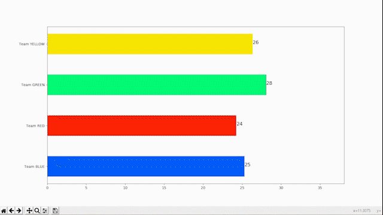

# RankingParty
A simple Python UI and visualization for partys. Split the guests into teams and then drink against each other
Using Pythons matplotlib, PyQT5 and TinyDB as simple JSON database.

Show updated data live in a horizontal bar graph:

Intuitive GUI based on PyQT5 to add new drinks into the database live:

